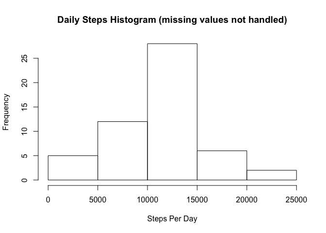
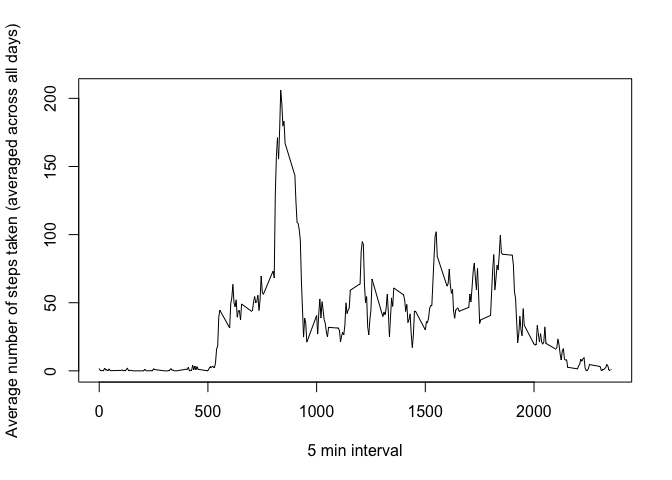
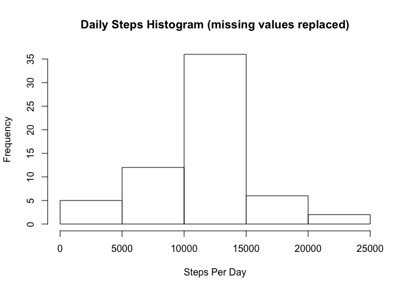

# Reproducible Research: Peer Assessment 1.  

###loading and preprocessing the data:

```r
fileUrl <- 'https://d396qusza40orc.cloudfront.net/repdata%2Fdata%2Factivity.zip'
download.file(fileUrl, 'activityMonitoring.zip', 'curl')
data <- unzip('activityMonitoring.zip')

data <- read.csv(data, colClasses = c('numeric', 'character', 'integer'))
data$date <- as.POSIXct(data$date)
str(data)
```

```
## 'data.frame':	17568 obs. of  3 variables:
##  $ steps   : num  NA NA NA NA NA NA NA NA NA NA ...
##  $ date    : POSIXct, format: "2012-10-01" "2012-10-01" ...
##  $ interval: int  0 5 10 15 20 25 30 35 40 45 ...
```

###What is the mean total number of steps taken per day (missing values not handled)?

Calculate the total number of steps taken per day:

```r
dailySteps <- aggregate(steps ~ date, data = data, FUN = 'sum' )
```

histogram of the total number of steps taken each day.

```r
hist(dailySteps$steps, main = 'Daily Steps Histogram (missing values not handled)', xlab = 'Steps Per Day')
```

 

### the mean and median of the total number of steps taken per day.
Mean:

```r
mean(dailySteps$steps)
```

```
## [1] 10766.19
```

Median:

```r
median(dailySteps$steps)
```

```
## [1] 10765
```


### Time series plot of the 5-minute interval (x-axis) and the average number of steps taken, averaged across all days (y-axis).

```r
intervalAverage <- aggregate(steps ~ interval, data = data, FUN = 'mean')
plot(intervalAverage, type= 'l' , xlab= '5 min interval', ylab= 'Average number of steps taken (averaged across all days)')
```

 


 The 5-minute interval, on average across all the days in the dataset, containing the maximum number of steps.

```r
maxStepsInterval <- intervalAverage[which.max(intervalAverage$steps),]
maxStepsInterval
```

```
##     interval    steps
## 104      835 206.1698
```
The interval with highest number of steps on average is 835 with 206.1698113 steps.  


The total number of missing values in the dataset.

```r
nas <- sum(is.na(data$steps))
nas
```

```
## [1] 2304
```
There are 2304 missing values in the steps column.  


###To adresse the potential bias introduced by missing values in the steps column they are replaced with the mean for that 5-minute interval.

```r
library(dplyr, quietly = T)
```

```
## 
## Attaching package: 'dplyr'
## 
## The following objects are masked from 'package:stats':
## 
##     filter, lag
## 
## The following objects are masked from 'package:base':
## 
##     intersect, setdiff, setequal, union
```


```r
dataFilled <- data
dataFilled <- dataFilled %>% group_by(interval) %>% mutate(steps= ifelse(is.na(steps), mean(steps, na.rm= T), steps))
dataFilled <- as.data.frame(dataFilled)
str(dataFilled)
```

```
## 'data.frame':	17568 obs. of  3 variables:
##  $ steps   : num  1.717 0.3396 0.1321 0.1509 0.0755 ...
##  $ date    : POSIXct, format: "2012-10-01" "2012-10-01" ...
##  $ interval: int  0 5 10 15 20 25 30 35 40 45 ...
```

Check for na's:

```r
sum(is.na(dataFilled$steps))
```

```
## [1] 0
```
### histogram of the total number of steps taken each day with the missing values replaced by the mean of interval.

```r
filledDailySteps <- aggregate(steps ~ date, data = dataFilled, FUN = 'sum' )
hist(filledDailySteps$steps, main = 'Daily Steps Histogram (missing values replaced)', xlab = 'Steps Per Day')
```

 


###The mean and median total number of steps taken per day (missing values replaced by the mean of interval).
Mean:

```r
mean(filledDailySteps$steps)
```

```
## [1] 10766.19
```
Median:

```r
median(filledDailySteps$steps)
```

```
## [1] 10766.19
```
###Are there differences in activity patterns between weekdays and weekends?

Create a new factor variable in the dataset with two levels – “weekday” and “weekend” .

```r
dataFilled <- mutate(dataFilled, 
                    dayType = ifelse(weekdays(dataFilled$date) == "Saturday" | weekdays(dataFilled$date) == "Sunday", "weekend", "weekday"))

dataFilled$dayType <- as.factor(dataFilled$dayType)
str(dataFilled)
```

```
## 'data.frame':	17568 obs. of  4 variables:
##  $ steps   : num  1.717 0.3396 0.1321 0.1509 0.0755 ...
##  $ date    : POSIXct, format: "2012-10-01" "2012-10-01" ...
##  $ interval: int  0 5 10 15 20 25 30 35 40 45 ...
##  $ dayType : Factor w/ 2 levels "weekday","weekend": 1 1 1 1 1 1 1 1 1 1 ...
```


### Panel plot  a time series plot  of the 5-minute interval (x-axis) and the average number of steps taken, averaged across all weekday days or weekend days (y-axis). 

```r
dataFilled <- dataFilled %>% group_by(interval, dayType) %>% summarise(steps = mean(steps))
library(lattice)
xyplot(steps ~ interval | dayType, data= dataFilled, type= 'l', layout= c(1,2), ylab = 'Number of steps')
```

 

There seems to be more steps earlier in the day on weekdays than on weekends.
